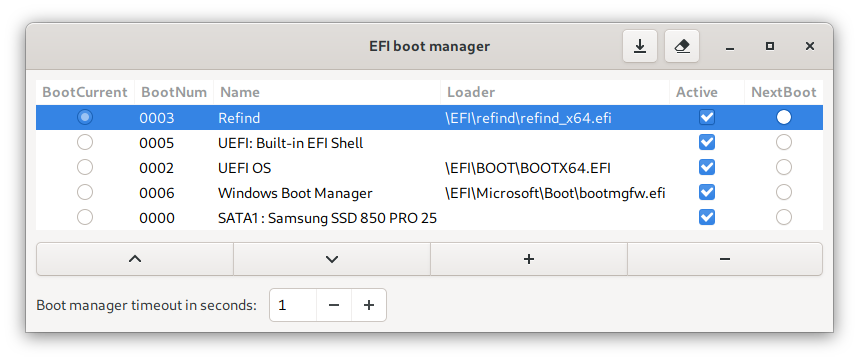

# efibootmgr-gui

Manage EFI boot loader entries with this simple GUI.

This is how it looks on my machine:  


You can:

- reorder, add, delete, enable or disable boot entries
- choose what to boot into at the next reboot (NextBoot)
- set the time to wait before the first entry (or the NextBoot one) is selected

Beware that efibootmgr acts on EFI variables and that could be dangerous on
non-standard compliant implementations.

## Dependencies

If you are using Debian GNU/Linux:

```
sudo apt install efibootmgr python3
```

Not all distros install **pyhton-gobject** automatically with Python3, but it is
required to run this script.

For Arch users:

```
sudo pacman -S efibootmgr python3 python-gobject
```

## Usage

```
python3 efibootmgr_gui.py
# that should be the same as
./efibootmgr_gui.py
```

**Note**: This program assumes that the EFI System Partition (ESP) is mounted at
`/boot/efi`.  
However you can use --efi=/dev/sd?? (e.g. sda1) to manually specify your
EFI System Partition (ESP).
